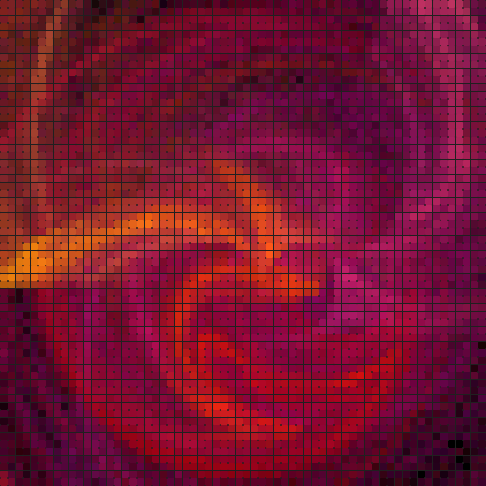
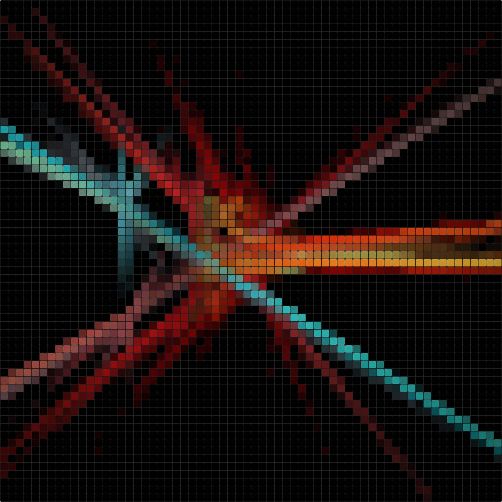

# BurntPix Benchmark - EVM killer 2.0


Burnt Pix are generative images, computed by the EVM. They are called EVM killers
because they are extremely computationally intensive, taking up billions to even
trillions of gas to compute a single image (at a high refinement count).

This repository does not contain the source code for the Burnt Pix generators,
rather it contains an Ethereum genesis file pre-seeded with the generator binary
to allow using it as a benchmark and stress test for EVM client implementations.

## How To Run

Running the generator requires:

- Initializing a new Ethereum network with the provided
[`genesis.json`](./genesis.json)
- Doing a `CALL` operation to run the generator:
  - Call contract `0x49206861766520746f6f206d7563682074696d65`
  - Call method `function run(uint32, uint256) returns (string)`
    - Calling the method id `0xa4de9ab4`
    - Send a `uint32` image seed (e.g. `0x0000000000000000000000000000000000000000000000000000000000000000`)
    - Send a `uint256` iteration count (e.g. `0x0000000000000000000000000000000000000000000000000000000000000400`)

Different seeds will produce different images based on a variety of mathematical
operations, so optimising across multiple ones might be better than focusing too
much on any one in particular. Also, it's always fun to see a different output and
not just raw numbers.

The iteration count influences how much computation is spent on producing the
output image. It can be used both as a fun aspect as well as a way to control
the runtime of the execution. From a visual perspective, 500K seems like a nice
value. It also takes a few seconds to run on Geth.

An example call via Geth's `evm` utility would be:

```bash
$ evm run --prestate ./genesis.json --receiver 0x49206861766520746F6F206D7563682074696D65  --input 0xa4de9ab40000000000000000000000000000000000000000000000000000000000000000000000000000000000000000000000000000000000000000000000000007A120
```

The output is a Ethereum ABI encoded string (in hex form in the case of Geth's
`evm` utility). Feel free to parse the string out to get the generated SVG image!

Since I know the output is a bytes array (word 1 == offset; word 2 == length; rest
== data) and I know the format is an ASCII string with a closing `</svg>` tag, we
can YOLO the decoding by ignoring the prefix and trimming the 0 byte suffix.

```
$ [evm run command] | tail -c +131 | sed 's/[0]*$//' | xxd -r -p > output.svg
```

You can finally add `--bench` to Geth's `evm` command to have a report on the
self-measured performance numbers. As a full example to render the above red dragon
image (in a fair but not extreme resolution): 

```bash
% evm run --prestate ./genesis.json --receiver 0x49206861766520746F6F206D7563682074696D65  --input 0xa4de9ab4000000000000000000000000000000000000000000000000000000000F1FD58E000000000000000000000000000000000000000000000000000000000007A120 --bench | tail -c +131 | sed 's/[0]*$//' | xxd -r -p > output.svg

EVM gas used:    5642735088
execution time:  10.824049458s
allocations:     482930
allocated bytes: 96876728

% open output.svg
```

[
](https://github.com/karalabe/burntpix-benchmark)

## Pretty Combos

Here are some pretty parameter combinations to keep you entertained whiles optimising :)

|            BurntPix            |     Seed     | Iterations |     Gas      |
|:------------------------------:|:------------:|:----------:|:------------:|
|           |    `0x0`     |  `7A120`   | `1194877856` |
|   | `0xD0FC9AE`  |  `7A120`   | `3720507082` |
|   | `0xF1FD58E`  |  `7A120`   | `5642735088` |
|   | `0x2456635E` |  `7A120`   | `2361285957` |
|   | `0x25FAAB93` |  `7A120`   | `2195254953` |
|   | `0x287FBB44` |  `7A120`   | `2152976762` |
|  | `0x3F502349` |  `7A120`   | `2529514632` |
|  | `0x58F5D174` |  `7A120`   | `1724272483` |
|  | `0xBAB62971` |  `7A120`   | `2499357241` |
|  | `0xCD3BAB83` |  `7A120`   | `2391316900` |
|  | `0xD72C0032` |  `7A120`   | `3264176440` |
|  | `0xFCC0C87B` |  `7A120`   | `2590196975` |
